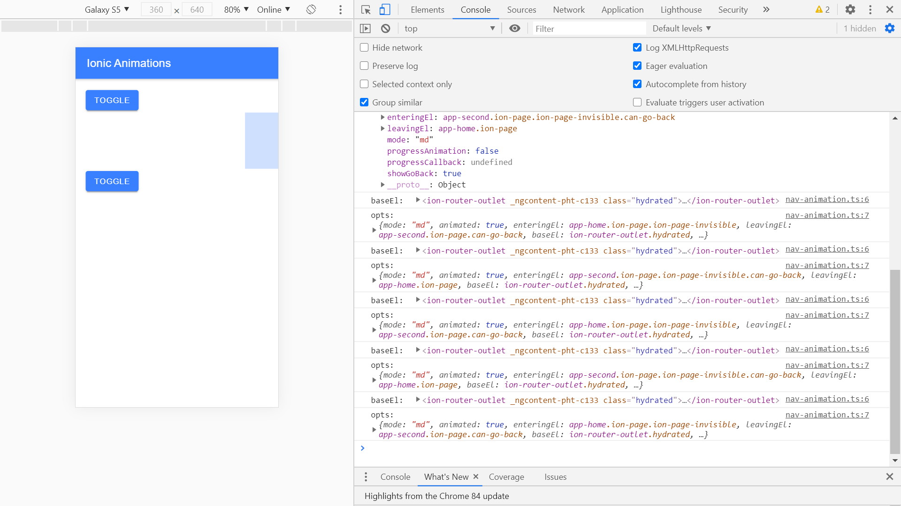

# :zap: Ionic Angular Custom Animations

* App created using the [Ionic framework](https://ionicframework.com/docs) to create custom animations.
* Another great tutorial from Simon Grimm at the [Ionic Academy](https://ionicacademy.com) - [:clap: Inspiration](#clap-inspiration) below.
* **Note:** to open web links in a new window use: _ctrl+click on link_


## :page_facing_up: Table of contents

* [:zap: Ionic Angular Custom Animations](#zap-ionic-angular-custom-animations)
  * [:page_facing_up: Table of contents](#page_facing_up-table-of-contents)
  * [:books: General info](#books-general-info)
  * [:camera: Screenshots](#camera-screenshots)
  * [:signal_strength: Technologies](#signal_strength-technologies)
  * [:floppy_disk: Setup](#floppy_disk-setup)
  * [:computer: Code Examples](#computer-code-examples)
  * [:cool: Features](#cool-features)
  * [:clipboard: Status & To-do list](#clipboard-status--to-do-list)
  * [:clap: Inspiration](#clap-inspiration)
  * [:file_folder: License](#file_folder-license)
  * [:envelope: Contact](#envelope-contact)

## :books: General info

* Creates custom animation of block moving horizontally across the screen
* Creates second page with custom navigation using animated transition
* updated to use latest Ionic 5 animation methods

## :camera: Screenshots



## :signal_strength: Technologies

* [Ionic v6](https://ionicframework.com/)
* [Angular v13](https://angular.io/)
* [Ionic/angular v6](https://www.npmjs.com/package/@ionic/angular)
* [Ionic Animations](https://ionicframework.com/docs/utilities/animations)

## :floppy_disk: Setup

* Run `npm i` to install dependencies
* To start the server on _localhost://8100_ type: 'ionic serve -o'

## :computer: Code Examples

* animation of nav forward direction:

```typescript
if (opts.direction === 'forward') {
  return animationCtrl
  .create()
  .addElement(opts.enteringEl)
  .duration(DURATION)
  .easing('ease-in')
  .fromTo('opacity', 0, 1);
}
```

## :cool: Features

* Animation parameters such as opacity, ease-in & ease-out times, duration, etc. can be customised. See 'Inspiration' below.

## :clipboard: Status & To-do list

* Status: Working.
* To-do: Nothing

## :clap: Inspiration

* Project inspired by [Simon Grimm´s Youtube video: Ionic 5 Animations Controller & Custom Page Transitions](https://www.youtube.com/watch?v=12myW2oJHU4&t=57s)
* [Ionic Animations documentation](https://ionicframework.com/docs/utilities/animations)

## :file_folder: License

* This project is licensed under the terms of the MIT license.

## :envelope: Contact

* Repo created by [ABateman](https://github.com/AndrewJBateman), email: gomezbateman@yahoo.com
