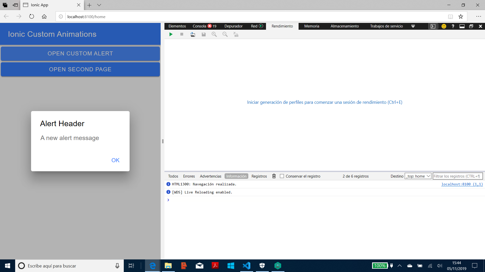
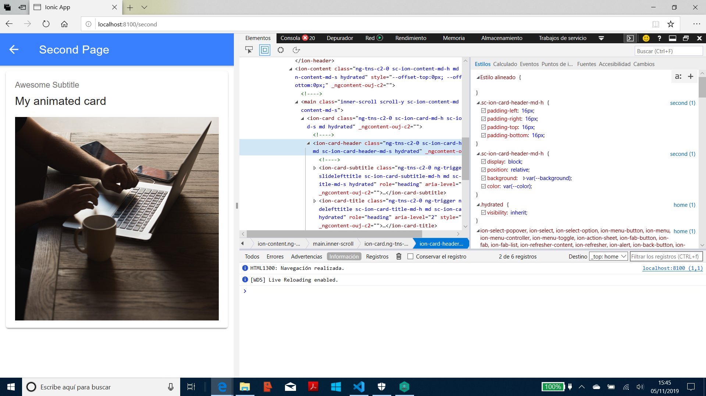

# Ionic Angular Custom Animations

App created using the [Ionic 5 framework](https://ionicframework.com/docs) to create custom animations. Another great tutorial from Simon Grimm at the [Ionic Academy](https://ionicacademy.com).

## Table of contents

* [General info](#general-info)
* [Screenshots](#screenshots)
* [Technologies](#technologies)
* [Setup](#setup)
* [Features](#features)
* [Status](#status)
* [Inspiration](#inspiration)
* [Contact](#contact)

## General info

* Creates customAlertEnter: a custom alert toast that drops down slowly from the top of the screen.

* Creates second.page: including a custom ion-card with an image and a title that slides gently from the right - speed etc. can be adjusted.

## Screenshots




## Technologies

* [Ionic v5.0.0](https://ionicframework.com/)

* [Angular v8.1.2](https://angular.io/)

* [Ionic/angular v4.7.1](https://www.npmjs.com/package/@ionic/angular)

## Setup

* To start the server on _localhost://8100_ type: 'ionic serve -o'

## Code Examples

* ion-card with custom animation:

```typescript
  <ion-card>
    <ion-card-header>
      <ion-card-subtitle @slidelefttitle>Awesome Subtitle</ion-card-subtitle>
      <ion-card-title @slidelefttitle>My animated card</ion-card-title>
    </ion-card-header>
    <ion-card-content @fadein>
      
    </ion-card-content>
  </ion-card>
```

## Features

* Animation parameters such as opacity, ease-in & ease-out times, duration, etc. can be customised. See Ionic website and Github links in 'Inspiration' below.

## Status & To-do list

* Status: Working.

* To-do: add more commenting.

## Inspiration

* Project inspired by [Simon Grimm´s Youtube video: How to Create Custom Ionic 4 Animations & Transitions](https://www.youtube.com/watch?v=sBv6m2Z3U6Q)

* [Devtactic written version: How to Create Custom Ionic 4 Animations & Transitions](https://devdactic.com/custom-ionic-animations/)

* [Ionic standard alert Material Design animation code](https://github.com/ionic-team/ionic/blob/master/core/src/components/alert/animations/md.enter.ts)

* [Ionic Framework Custom Config documentation](https://ionicframework.com/docs/utilities/config)

## Contact

Repo created by [ABateman](https://www.andrewbateman.org) - feel free to contact me!
